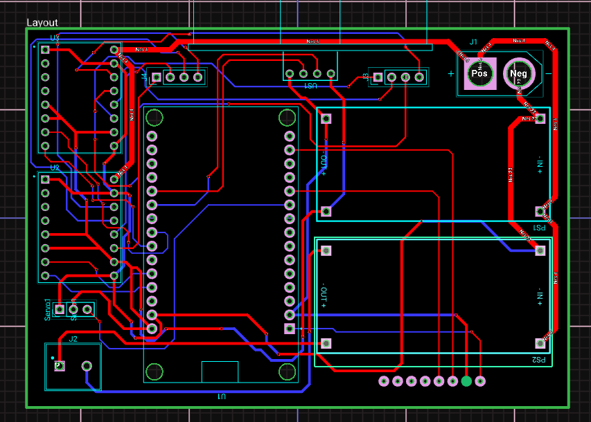
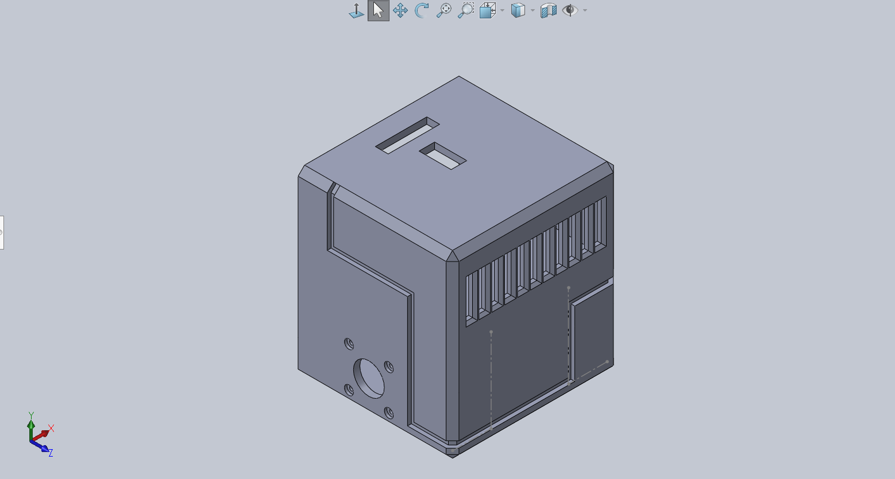
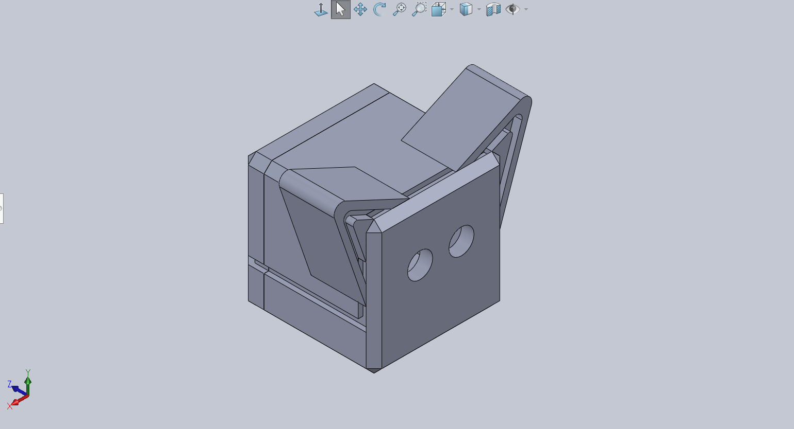
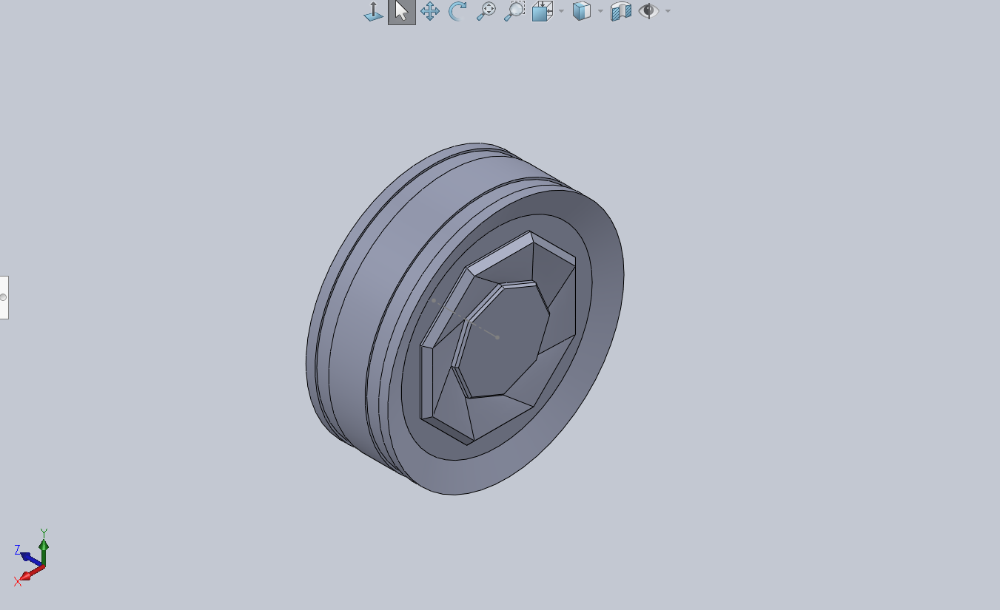

# Meow.exe 🐱
### A self-balancing two-wheeled robot

---

> **Status:** 90% Complete (PID Tuning)
> **Brain:** ESP32

---

## What is this?

Meow.exe is a self-balancing robot loosely designed to look like a cat. It uses an ESP32 microcontroller, a custom PCB, stepper motors, and an MPU6050 IMU to stay upright.


This repo documents the full build — hardware, firmware, PCB design, and the many things that went wrong along the way.

---

## Table of Contents

1. [The Concept](#the-concept)
2. [Hardware](#hardware)
3. [Electronics & PCB](#electronics--pcb)
4. [Firmware](#firmware)
5. [3D Printing](#3d-printing)
6. [Failures](#failures)
7. [Current Status](#current-status)
8. [What's Next](#whats-next)
9. [Build Your Own](#build-your-own)

---

## The Concept

Self-balancing robots are a classic control systems project, basically an inverted pendulum problem. The robot reads its tilt angle from an IMU, runs that through a PID controller, and drives its wheels to counteract the fall. Simple in theory. Absolutely not simple in practice.

The cat theme came because the chassis shape lends itself to a boxy, four-legged-but-actually-two-wheeled silhouette. Ears on the top enclosure. Tail maybe eventually. We'll see.

---

## Hardware

| Component | Part | Notes |
|---|---|---|
| Microcontroller | ESP32 | Wi-Fi + Bluetooth built in, plenty of GPIO |
| IMU | MPU6050 | 6-axis accelerometer/gyroscope over I2C |
| Motors | NEMA 17 — 17HS4401 | See the motor saga below |
| Motor drivers | A4988 | Stepstick-style |
| Power | 4S LiPo, 1300mAh | See the LED rabbit hole below |
| Buck converters | LM2596S ×2 | One for logic/motors, one for the LEDs (sigh) |
| Power switch | 30A/50A inline XT60 switch | Second attempt — see failure 7 |
| Ultrasonic sensor | HC-SR04 | Obstacle detection, mounted in the head |
| Head servo | Generic 9g servo | Rotates the head/sensor to scan left and right |
| Frame | Custom 3D printed PLA | Multiple iterations (see printing section) |
| PCB | Custom designed | KiCad, ordered from PCBway |
| Tires | Dollar store rubber bands | Temporary grip solution (it works) |


### The Motor Saga

The original motors were **17HS4023** pancake steppers — compact, low-profile, seemed perfect for keeping the chassis thin. They were not perfect. They produced effectively zero usable torque at the speeds needed for balancing. The robot would lean, the motors would whirr heroically, and then it would fall over anyway.

Swapped to **17HS4401s** — longer, heavier, but actually capable of holding torque. This required redesigning the motor mounts and reprinting a chunk of the chassis, but the difference was night and day.

**Lesson:** For balancing robots, torque at speed matters more than motor compactness. Don't cheap out on the motors.


### The Eyes

The cat's head houses an **HC-SR04 ultrasonic sensor** — the eyes. When Meow.exe gets too close to a wall or obstacle, it's supposed to back up, turn its head left and right to scan for a clear path, then turn and continue in whichever direction has more room.

The head itself sits on a small servo motor, which rotates the sensor to look left and right during the scan. This is also what gives the robot the most cat-like behaviour in the whole build — watching it slowly turn its head to check both sides before deciding where to go is weirdly characterful.

The avoidance logic runs as a state machine layered on top of the PID balance loop: `BALANCING → REVERSING → SCANNING → TURNING → BALANCING`. The robot stays balanced throughout because the PID never stops running — avoidance just changes what bias gets added to the motor output on top of the balance correction.

> This feature is planned and coded but not yet physically tested.

---

## Electronics & PCB

The brain is a custom PCB designed in KiCad and ordered from PCBway. It routes the ESP32, A4988 motor driver breakouts, IMU, two LM2596S buck converters, and power management onto a single board so the wiring doesn't look like a bird's nest.



### The GND Pin Incident

While laying out the PCB footprint for the MPU6050, the GND pin wasn't set as a through-hole. This only became apparent after the boards came back from fab. The fix involved some creative bodge-wiring to route GND externally — not pretty, but functional.

This is why you double-check every single pin in your footprint before you send to fab. Every single one.


### PCB Tuning

PCB tuning was, in a word, painful. Getting the PID gains right while also debugging whether any given misbehaviour was a tuning issue or a hardware/wiring issue is one of those tasks where you genuinely cannot tell which problem you're solving. Highly recommend:

- Logging IMU angle and motor output over serial (or Wi-Fi if you're fancy)
- Tuning P first until it oscillates, then D to dampen, then I carefully
- Having snacks nearby because it takes a while

---

## Firmware

The firmware runs on the ESP32 using the Arduino framework (via PlatformIO). It's split into modules so tuning one thing doesn't mean touching everything else.

**Core loop:**
1. Read MPU6050 via I2C → compute pitch angle
2. Feed pitch error into PID controller
3. Add forward bias and any turn bias to PID output
4. Drive A4988 stepper drivers as step pulses at 100Hz
5. Separately: poll HC-SR04 and run state machine for obstacle avoidance

```
firmware/
  platformio.ini
  src/
    main.cpp        — setup, loop, state machine
    config.h        — all pins, gains, and tunable constants in one place
    imu.cpp / .h    — MPU6050 init and pitch reading
    pid.cpp / .h    — PID controller
    motors.cpp / .h — AccelStepper wrapper for the two NEMA 17s
    obstacle.cpp/.h — HC-SR04 distance reading and servo head scan logic
```

> ⚠️ Firmware is still being tuned — don't expect stable PID values yet. Constants will be updated as the build progresses.

---

## 3D Printing

The chassis went through several size iterations before landing on the current design. The first two prints came out too small — motors didn't fit, PCB didn't fit, clearances were wrong. At one point the wheel wells were so tight the motors couldn't turn without binding.


Current print settings that work:
- **Material:** PLA
- **Layer height:** 0.2mm
- **Infill:** 10% gyroid for the body, 12% gyroid for the wheels — kept deliberately low to save weight without sacrificing too much structural integrity
- **Supports:** Required for the motor mount overhangs





The gyroid pattern specifically is worth using for anything load-bearing at low infill — it distributes stress more evenly than grid or lines and holds up better under vibration (which a balancing robot produces constantly).

All source files are in `/cad` as `.stl` and editable source files.

---

## Failures

Every build log should have a section like this. Here's the honest timeline:

**Failure 1 — Wrong motors**
Ordered 17HS4023 pancake motors because they looked sleek. They could not generate enough torque to balance the robot. Ordered 17HS4401s. Reprinted motor mounts.

**Failure 2 — Print sizing**
"It'll definitely fit" — it did not fit. Happened more than once. Each iteration cost a day of print time. Measure twice, print once.

**Failure 3 — PCB footprint GND not through-hole**
The MPU6050 footprint in the PCB design had the GND pin missing from the through-hole list. Boards came back and the IMU wouldn't ground properly. Worked around it with a bodge wire. Will fix in rev 2.

**Failure 4 — The LED Strip Tax**
I wanted an LED light strip around the robot purely for aesthetics. Seemed simple. It was not simple.

The LED strip runs on 12V, which made it the *only* 12V component on the entire PCB. Everything else runs at lower voltages off one buck converter. But the LEDs needed their own dedicated LM2596S buck converter set to 12V, which also pushed me from a 3S LiPo to a 4S — because you need headroom above 12V for the buck converter to actually regulate down to it.

So: one aesthetic decision → one extra buck converter → battery upgrade → PCB redesign → more time. The LEDs better look incredible.

**Failure 5 — PID hell**
Not a single failure, more of an ongoing experience. Getting the derivative gain wrong produces a robot that vibrates violently at its natural frequency and sounds deeply unwell. Getting the integral gain wrong causes it to slowly drift and fall with quiet dignity.

**Failure 6 — The servo mount (ongoing)**
Fitting the HC-SR04 and servo into the cat head in a way that actually looks like a cat head, has room for the wiring, and lets the servo rotate freely has so far produced several head designs that don't work. The sensor needs to be positioned so it has a clear line of sight, the servo needs a mount that doesn't flex under load, and it all needs to look intentional. Currently on iteration three.

**Failure 7 — The switch that would have burned everything down**
The original plan was a tiny KCD1 mini rocker switch — the kind you'd find in a cheap desk lamp, rated for 6–10A. A 4S LiPo can dump well over 50A into a short circuit. That switch would not have had a good time. Swapped it for a proper 30A/50A inline XT60 switch designed for high-current RC applications, which is what should have been on the BOM from day one. Always check that your power switch is rated well above your battery's continuous discharge current, not just the average draw.

**Failure 8 — PCB has nowhere to live**
Designed the PCB, ordered the PCB, assembled the PCB, then realized there was nowhere to actually mount it inside the chassis. No standoff holes, no integrated slots, no clearance designed around it. The fix was double-sided foam tape, which is functional and used in plenty of real products but was not the original vision. Rev 2 of the PCB will have proper M3 mounting holes. Rev 2 of the chassis will have posts to match.


**Failure 9 — Dollar store rubber bands for tires**
TPU filament would have made flexible, grippy tires. TPU filament was not available. The wheels were PLA, which has roughly the grip of a bar of soap on most floors. The solution was rubber bands from a dollar store stretched over the wheel rims. It works. It looks exactly like what it is. It will be replaced eventually.

---

## Current Status

- [x] PCB designed and ordered
- [x] Motors selected (second attempt)
- [x] Chassis printed (current iteration)
- [x] MPU6050 bodge in place and reading data
- [x] LED strip rabbit hole survived
- [x] Power switch upgraded to something that won't catch fire
- [x] PCB mounted (foam tape, no judgment)
- [x] Obstacle avoidance logic written
- [x] Head servo mount designed and printed
- [ ] Obstacle avoidance physically tested
- [ ] PID tuning complete
- [x] Stable balancing achieved
- [ ] Proper TPU tires (currently: rubber bands)
- [x] Meow.exe ears installed

---

## What's Next

- Finish PID tuning and get stable balance while moving
- Make the LED strip actually look good after all the suffering it caused

---

## Build Your Own

> Full BOM, KiCad files, STLs, and firmware coming as the build stabilises.

If you want to attempt something similar, here's the short version of what I'd tell past-me:

1. **Use real torque motors from the start.**
2. **Check every PCB footprint pin by pin**
3. **Print a test piece**
4. **Log everything**
5. **The robot will fall over.**
6. **Think through your full voltage budget**
7. **Your power switch must be rated for your battery.**
8. **Design PCB mounting into your chassis from the start.**
9. **If you don't have TPU for grippy tires, rubber bands are a legitimate stopgap.**
---
